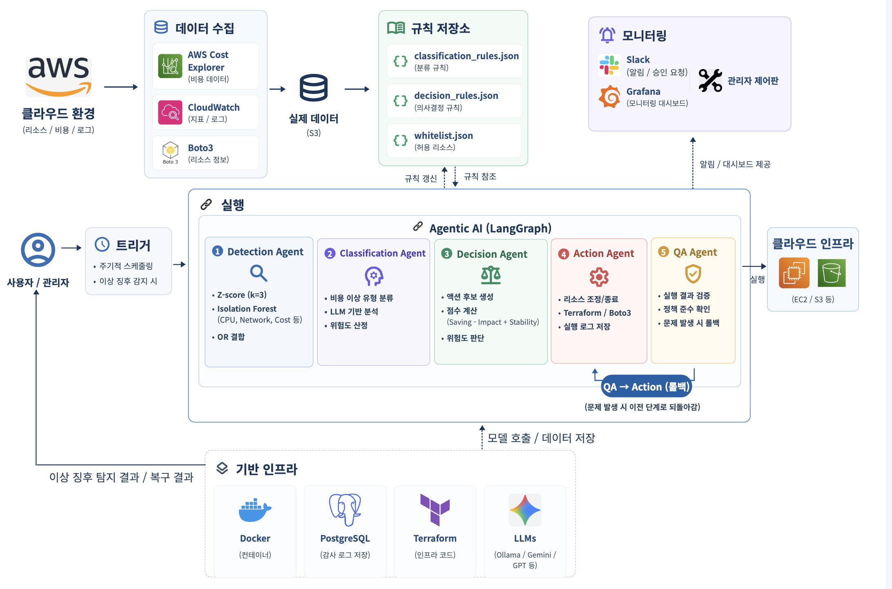

# Detection
### Agentic AI 기반 클라우드 비용 이상 징후 탐지 및 자율 복구 시스템

---

## 1. 프로젝트 배경

### 1.1 시장현황

클라우드 서비스 시장은 매년 급격히 성장하고 있으며, 기업들의 클라우드 지출 규모도 함께 증가하고 있습니다. Flexera의 2024 State of the Cloud Report에 따르면, 기업들은 평균적으로 클라우드 예산의 약 28%를 낭비하고 있으며, 이는 전년 대비 증가한 수치입니다.

이러한 비용 낭비를 방지하기 위해 **FinOps(Cloud Financial Operations)** 방법론이 등장했습니다. FinOps는 클라우드 비용을 실시간으로 모니터링하고 최적화하는 운영 프레임워크로, FinOps Foundation을 중심으로 빠르게 확산되고 있습니다.

그러나 현실적으로 **중소규모 기업은 FinOps 전담 인력을 두기 어렵습니다.** FinOps 엔지니어는 클라우드 아키텍처, 비용 분석, 자동화 스크립팅 등 다양한 역량을 필요로 하며, 전문 인력 채용에는 높은 비용이 수반됩니다. 결과적으로 많은 기업들이 비용 이상 징후를 사후에 발견하거나, 아예 인지하지 못한 채 불필요한 지출을 지속하게 됩니다.

### 1.2 필요성과 기대효과

#### 필요성

| 구분 | 기존 도구의 한계 | Detection 시스템의 해결 방안 |
|------|------------------|------------------------------|
| **AWS Cost Anomaly Detection** | 탐지만 제공, 복구는 수동 | 탐지부터 복구까지 자동화된 파이프라인 |
| **CloudHealth, Spot.io** | 월 단위 리포트 중심, 실시간성 부족 | 5분 단위 실시간 모니터링 및 즉각 대응 |
| **AWS Auto Scaling** | 사전 정의된 메트릭 기반, 비용 관점 부재 | 비용 이상 징후를 직접 탐지하고 비용 효율적 액션 선택 |
| **수동 모니터링** | 인력 의존, 휴먼 에러 발생 | AI 기반 24/7 자동 감시 및 일관된 판단 |

기존 FinOps 도구들은 대부분 **탐지(Detection)**에 집중하며, 실제 **복구(Remediation)**는 운영자가 직접 수행해야 합니다. 또한 AWS Auto Scaling은 CPU, 메모리 등 성능 메트릭 기반으로 동작하므로, **비용 이상(cost anomaly)**을 직접 다루지 않습니다.

#### 기대효과

- **비용 절감**: EC2 좀비 인스턴스 100대 기준 월 약 $763 절감 가능
- **운영 효율화**: MTTD(평균 탐지 시간) 0.204초, MTTR(평균 복구 시간) 약 313.7초
- **인력 부담 감소**: FinOps 전담 인력 없이도 비용 이상 징후 자동 대응 가능
- **리스크 관리**: Human-in-the-Loop(HITL) 승인 게이트로 고위험 액션 통제

---

## 2. 개발 목표

### 2.1 목표

1. **실시간 비용 이상 징후 탐지**: CloudWatch 메트릭을 5분 단위로 수집하여 Isolation Forest, Z-score, 절대 임계값 기반으로 이상 탐지
2. **자동화된 복구 파이프라인**: 탐지된 이상에 대해 분류 → 의사결정 → 액션 실행 → 품질검증까지 자동 수행
3. **Human-in-the-Loop 지원**: 고위험 액션(리스크 MEDIUM 이상)에 대해 관리자 승인 게이트 적용
4. **확장 가능한 룰북 시스템**: JSON 기반 룰북으로 새로운 이상 유형과 대응 정책을 코드 변경 없이 추가

### 2.2 차별성

| 특징 | 기존 솔루션 | Detection |
|------|-------------|-----------|
| **아키텍처** | 단일 모놀리식 또는 단순 룰 기반 | LangGraph 기반 6-에이전트 멀티에이전트 파이프라인 |
| **탐지 방식** | 단일 알고리즘 의존 | Isolation Forest + Z-score + 절대 임계값 앙상블 |
| **복구 범위** | 알림만 제공 또는 수동 복구 | 탐지부터 복구, QA까지 End-to-End 자동화 |
| **리스크 관리** | 없음 또는 전체 차단 | 리스크 레벨별 차등 승인 (LOW: 자동, MEDIUM+: HITL) |
| **확장성** | 하드코딩된 룰 | JSON 룰북 + 화이트리스트로 동적 정책 관리 |
| **비용 관점** | 성능 메트릭 중심 | 비용 메트릭 직접 모니터링 및 비용 효율적 액션 선택 |

### 2.3 사회적 가치

- **중소기업 클라우드 접근성 향상**: FinOps 전담 인력 없이도 엔터프라이즈급 비용 관리 가능
- **탄소 발자국 감소**: 유휴 리소스(좀비 인스턴스 등) 자동 정리로 불필요한 컴퓨팅 자원 소비 감소
- **운영 인력의 고부가가치 업무 집중**: 반복적인 비용 모니터링을 자동화하여 인력을 혁신 업무에 재배치

---

## 3. 시스템 설계

### 3.1 구성도



**파이프라인 흐름**:
1. **Detection Agent**: CloudWatch에서 메트릭 수집 → Isolation Forest/Z-score/절대 임계값으로 이상 탐지
2. **Classification Agent**: LLM(Gemini)으로 이상 유형 분류 (예: idle_zombie, retry_spike 등)
3. **Decision Agent**: 룰북 조회 → 리스크 레벨에 따라 액션 선택 및 승인 게이트 결정
4. **Action Agent**: boto3로 AWS API 호출하여 복구 액션 실행 (Stop, Throttle, WAF Rule 등)
5. **QA Agent**: 액션 실행 후 상태 검증 (실제로 중지되었는지, 스로틀링이 적용되었는지 등)
6. **Logging Agent**: 전체 흐름을 PostgreSQL에 기록, Grafana 대시보드로 시각화

### 3.2 사용 기술

| 분류 | 기술 | 버전 | 용도 |
|------|------|------|------|
| **Core Framework** | LangGraph | 1.1.10 | 멀티에이전트 오케스트레이션 |
| **LLM** | Google Gemini | gemini-2.0-flash | 이상 유형 분류 및 의사결정 |
| **ML** | scikit-learn | 1.7.2 | Isolation Forest 이상 탐지 |
| **Cloud SDK** | boto3 | 1.43.3 | AWS API 연동 |
| **Backend** | FastAPI | 0.115.6 | REST API 서버 |
| **Frontend** | React | 18.3.1 | 관리자 대시보드 |
| **Database** | PostgreSQL | 16 | 로그 및 상태 저장 |
| **Monitoring** | Grafana | 11.4.0 | 메트릭 시각화 |
| **Language** | Python | 3.13 | 백엔드 개발 |

---

## 4. 개발 결과

### 4.1 흐름도

```
사용자 요청 / 스케줄러 트리거
            │
            ▼
    ┌───────────────┐
    │ Detection Agent│  ← CloudWatch 메트릭 수집 (5분 윈도우)
    │ - Isolation Forest
    │ - Z-score
    │ - 절대 임계값
    └───────┬───────┘
            │ anomaly_flag = True
            ▼
    ┌───────────────┐
    │Classification │  ← LLM(Gemini)으로 이상 유형 분류
    │    Agent      │
    └───────┬───────┘
            │ anomaly_type (예: idle_zombie)
            ▼
    ┌───────────────┐
    │ Decision Agent│  ← 룰북 조회, 리스크 평가
    └───────┬───────┘
            │
    ┌───────┴───────┐
    │ Risk Level?   │
    ├───────────────┤
    │ LOW           │──→ 자동 실행
    │ MEDIUM/HIGH   │──→ 승인 게이트 (HITL)
    └───────────────┘
            │
            ▼
    ┌───────────────┐
    │  Action Agent │  ← boto3로 AWS API 호출
    │ - EC2 Stop
    │ - Lambda Throttle
    │ - WAF Rate Rule
    └───────┬───────┘
            │
            ▼
    ┌───────────────┐
    │    QA Agent   │  ← 액션 결과 검증
    └───────┬───────┘
            │
            ▼
    ┌───────────────┐
    │ Logging Agent │  ← PostgreSQL 기록
    └───────────────┘
```

### 4.2 기능명세

#### 지원 이상 유형 및 대응 액션

| 이상 유형 | 리소스 | 탐지 조건 | 대응 액션 | 리스크 |
|-----------|--------|-----------|-----------|--------|
| **idle_zombie** | EC2 | CPU < 5%, Network ≈ 0, 비용 발생 | Stop Instance | LOW |
| **overprovisioned** | EC2 | CPU 지속 저조, 고사양 인스턴스 | Resize 권고 | MEDIUM |
| **retry_spike** | Lambda | Error Rate > 50%, Throttle 급증 | Reserved Concurrency 0 | MEDIUM |
| **mass_download** | S3 | 요청/다운로드 급증, 외부 IP | WAF Rate-based Rule | HIGH |
| **edos_attack** | AutoScaling | 비정상적 스케일아웃 패턴 | Max Capacity 제한 | HIGH |

#### 탐지 모델 성능

| 시나리오 | Accuracy | Recall | F1-Score | 95% CI (Clopper-Pearson) |
|----------|----------|--------|----------|--------------------------|
| EC2 좀비 | 92.3% | 100% | 0.91 | [64%, 100%] |
| Lambda 재시도 폭증 | 84.6% | 80.0% | 0.80 | [44%, 97%] |
| AutoScaling EDoS | 84.6% | 80.0% | 0.80 | [44%, 97%] |
| **평균** | **86.7%** | **85.7%** | - | - |

### 4.3 디렉토리

```
langgraph_study/
├── api/                    # FastAPI 백엔드
│   ├── main.py            # API 엔트리포인트
│   ├── routers/           # API 라우터
│   └── schemas.py         # Pydantic 스키마
├── pipeline/              # 에이전트 파이프라인
│   ├── detection_agent.py # Detection Agent
│   ├── classification_agent.py
│   ├── decision_agent.py
│   ├── action_agent.py
│   ├── qa_agent.py
│   └── logging_agent.py
├── schema/                # 룰북 및 설정
│   ├── rule_book.py       # 룰북 로더
│   └── rules/             # JSON 룰 정의
├── models/                # ML 모델 캐시
├── frontend/              # React 프론트엔드
│   └── src/
│       ├── components/    # React 컴포넌트
│       └── api.js         # API 클라이언트
├── playground/            # 실험 및 평가 스크립트
└── config/                # 환경 설정
```

### 4.4 멘토링

본 프로젝트는 부산대학교 정보컴퓨터공학부 졸업과제로 수행되었으며, 다음의 지도를 받았습니다:

- **지도교수**: 부산대학교 정보컴퓨터공학부
- **산업체 멘토**: 클라우드 인프라 및 FinOps 분야 실무 자문

---

## 5. 설치 및 실행 방법

### 사전 요구사항

- Python 3.13+
- Node.js 18+
- PostgreSQL 16
- AWS 계정 및 자격 증명

### 백엔드 설치

```bash
# 저장소 클론
git clone https://github.com/PNU-Detection/langgraph_study.git
cd langgraph_study

# 가상환경 생성 및 활성화
python -m venv .venv
source .venv/bin/activate  # Windows: .venv\Scripts\activate

# 의존성 설치
pip install -r requirements.txt

# 환경 변수 설정
cp .env.example .env
# .env 파일에 AWS 자격 증명, Gemini API 키, DB 연결 정보 입력
```

### 프론트엔드 설치

```bash
cd frontend
npm install
```

### 실행

```bash
# 백엔드 실행 (프로젝트 루트에서)
uvicorn api.main:app --reload --port 8000

# 프론트엔드 실행 (frontend 디렉토리에서)
npm start
```

### Docker Compose (선택)

```bash
docker-compose up -d
```

---

## 6. 소개 자료 및 시연 영상

- **발표 자료**: [2026전기 최종발표 PPT](docs/2026전기_27_Detection_ppt.pdf)
- **시연 영상**: [YouTube 링크](https://youtu.be/Azj146SFHJM?si=KHH0drJV2E6j-fyP)

---

## 7. 팀 구성

| 이름 | 역할 | 담당 |
|------|------|------|
| **강지원** | Backend / DevOps | Rule Book 설계, QA Agent, WAF 연동 |
| **박소영** | ML / Backend | Detection Agent, Logging Agent, Isolation Forest 모델 |
| **허소영** | Frontend / LLM | Classification Agent, Action Agent, React 관리자 대시보드 |

**소속**: 부산대학교 정보컴퓨터공학부

---

## 8. 참고 문헌 및 출처

1. Flexera. (2024). *State of the Cloud Report*. https://www.flexera.com/blog/cloud/cloud-computing-trends-flexera-2024-state-of-the-cloud-report/
2. FinOps Foundation. (2024). *What is FinOps?*. https://www.finops.org/introduction/what-is-finops/
3. AWS. (2024). *AWS Cost Anomaly Detection*. https://aws.amazon.com/aws-cost-management/aws-cost-anomaly-detection/
4. Liu, F. T., Ting, K. M., & Zhou, Z. H. (2008). *Isolation Forest*. IEEE International Conference on Data Mining.
5. LangChain. (2024). *LangGraph Documentation*. https://langchain-ai.github.io/langgraph/
6. Google. (2024). *Gemini API Documentation*. https://ai.google.dev/docs
